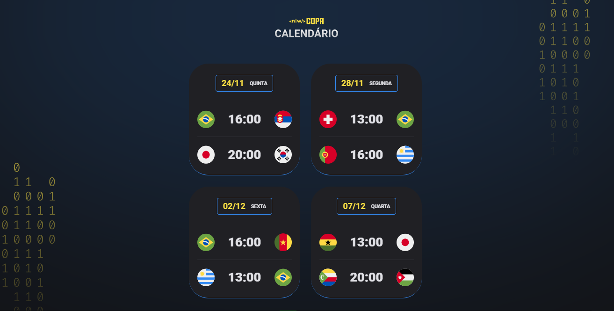
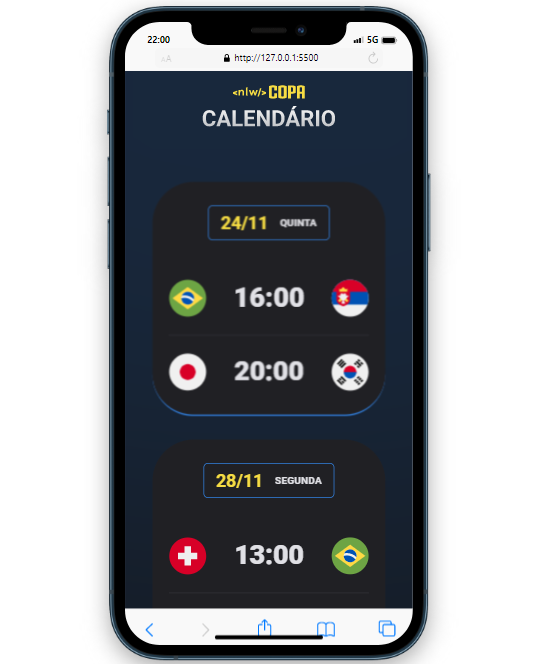

<h1 align="center"> NLW #10 Copa </h1>

Este projeto é resultado de um evento promovido pela Rocketseat para ensino de tecnologias WEB.

 

<h2 align="center">WEB:</h2>

  

 

<h2 align="center">Mobile:</h2>

    

## 🚀 Tecnologias

Esse projeto foi desenvolvido com as seguintes tecnologias:

- HTML e CSS
- JavaScript
- Git e Github

## 💻 Projeto

O Calendário da Copa é um projeto que mostra os jogos da Copa de 2022.